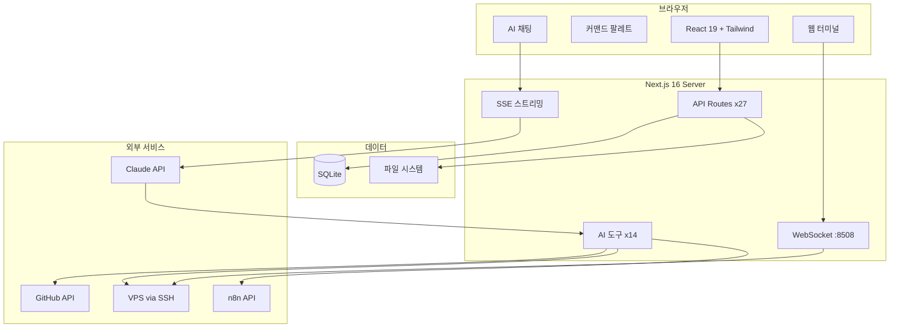
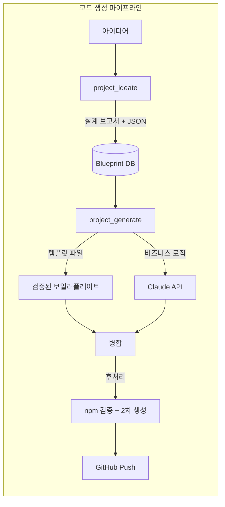

# Nexus Dashboard

개발자를 위한 로컬 프로젝트 관리 대시보드. 내 PC의 모든 개발 프로젝트를 한눈에 보고, 관리하고, 배포한다.

## 주요 기능

### 프로젝트 관리
- **자동 스캔** — Desktop 폴더의 모든 개발 프로젝트 자동 탐지
- **멀티 뷰** — Grid / List / Stats / Codex(모닝 브리핑) 뷰 전환
- **그룹 & 태그** — 프로젝트 분류, 필터링, 검색
- **커맨드 팔레트** — `Ctrl+K`로 빠른 프로젝트 탐색
- **실행 관리** — npm run dev, VSCode 열기, 폴더 열기 원클릭

### Git & GitHub
- **Git 연동** — 브랜치, 커밋 히스토리, 변경 파일 표시
- **GitHub OAuth** — 저장소 연결, Actions 상태, Clone
- **AI 커밋 메시지** — 변경사항 분석 후 자동 생성

### AI 채팅 (Claude 연동)
- **스트리밍 채팅** — SSE 기반 실시간 응답
- **도구 14개** — 프로젝트 조회, VPS 관리, 코드 생성 등
- **승인 시스템** — 위험한 도구 실행 전 사용자 승인
- **코드 생성** — 아이디어 → 설계 → 코드 → GitHub Push 자동화

### 인프라 관리
- **VPS 모니터링** — SSH로 메모리, 디스크, Docker 상태 실시간 조회
- **Docker 관리** — 컨테이너 로그, 서비스 재시작
- **웹 터미널** — 브라우저에서 SSH 터미널 직접 사용
- **배포** — git pull → docker compose up 원클릭 배포

### 분석 & 통계
- **활동 히트맵** — GitHub 스타일 일일 활동 시각화
- **스트릭 & 뱃지** — 연속 코딩일, 달성 배지
- **주간 리포트** — 커밋, 파일 변경, 작업 시간 요약
- **의존성 감사** — npm audit 기반 보안 점검

### 기타
- **모닝 브리핑** — 오늘 집중할 프로젝트, 알림, 서버 상태 요약
- **트렌드 피드** — 기술 트렌드 자동 수집
- **PWA** — 설치 가능한 웹 앱
- **파일 브라우저** — 프로젝트 파일 트리 + 미리보기

## 기술 스택

| 영역 | 기술 |
|------|------|
| Framework | Next.js 16 (App Router, Turbopack) |
| UI | React 19, Tailwind CSS 4, Framer Motion |
| Database | SQLite (better-sqlite3) |
| Auth | JWT (jose) + bcrypt |
| AI | Claude API (Anthropic) |
| Terminal | node-pty + xterm.js + WebSocket |
| SSH | ssh2 |
| Icons | Lucide React |
| 기타 | cmdk, date-fns, react-markdown, chokidar |

## AI 도구 목록

| 도구 | 권한 | 설명 |
|------|------|------|
| `project_list` | read | 등록된 프로젝트 목록 + 배포 정보 |
| `http_health_check` | read | 배포 URL 상태 확인 |
| `vps_status` | read | VPS 메모리/디스크/Docker 상태 |
| `docker_logs` | read | 컨테이너 로그 조회 |
| `n8n_executions` | read | n8n 워크플로 실행 히스토리 |
| `git_status` | read | 프로젝트 Git 상태 |
| `get_trends` | read | 기술 트렌드 조회 |
| `project_ideate` | read | 아이디어 → 설계 보고서 생성 |
| `check_generation` | read | 코드 생성 진행률 확인 |
| `service_restart` | write | Docker 서비스 재시작 |
| `deploy_trigger` | write | VPS 배포 실행 |
| `n8n_workflow_toggle` | write | n8n 워크플로 활성화/비활성화 |
| `project_generate` | write | 설계 기반 코드 생성 + GitHub Push |

## 아키텍처





## 프로젝트 구조

```
nexus-dashboard/
├── src/
│   ├── app/
│   │   ├── api/              # API 라우트 (27개 그룹)
│   │   │   ├── ai/chat/      # AI 채팅 (SSE 스트리밍)
│   │   │   ├── git/           # Git 연동
│   │   │   ├── vps/           # VPS 관리
│   │   │   ├── github/        # GitHub OAuth
│   │   │   └── ...
│   │   ├── login/             # 로그인 페이지
│   │   └── page.tsx           # 메인 대시보드
│   ├── components/            # React 컴포넌트 (34개)
│   │   ├── AIChatPanel.tsx    # AI 채팅 UI
│   │   ├── ProjectCard.tsx    # 프로젝트 카드
│   │   ├── ProjectModal.tsx   # 프로젝트 상세
│   │   ├── Sidebar.tsx        # 사이드바
│   │   ├── CommandPalette.tsx  # Ctrl+K 팔레트
│   │   ├── Terminal.tsx       # 웹 터미널
│   │   ├── settings/          # 설정 탭들
│   │   └── codex/             # 모닝 브리핑
│   ├── hooks/                 # 커스텀 훅 (5개)
│   └── lib/
│       ├── ai/tools.ts        # AI 도구 정의 (14개)
│       ├── db/                # SQLite 모듈
│       ├── crypto.ts          # 암호화
│       ├── auth.ts            # 인증
│       ├── ssh.ts             # SSH 연결
│       └── terminal-server.ts # 터미널 서버
├── deploy/
│   ├── docker-compose.prod.yml # 프로덕션 배포
│   └── nginx.conf             # 리버스 프록시
├── Dockerfile                 # 3단계 멀티스테이지 빌드
└── package.json
```

## 설치 & 실행

### 로컬 개발

```bash
git clone https://github.com/ongye7-hash/nexus-dashboard.git
cd nexus-dashboard
npm install
npm run dev
# http://localhost:8507
```

### Docker 배포 (프로덕션)

```bash
# 1. 클론
git clone https://github.com/ongye7-hash/nexus-dashboard.git
cd nexus-dashboard

# 2. 빌드 & 실행
cd deploy
docker compose -f docker-compose.prod.yml up -d --build

# 3. nginx 설정 (deploy/nginx.conf 참고)
# 4. https://your-domain.com 접속
```

### 환경변수

별도의 환경변수 설정이 필요 없다. 모든 설정은 대시보드 UI의 Settings에서 관리하며, 암호화되어 SQLite에 저장된다.

- **Claude API 키** — Settings > AI
- **GitHub 토큰** — Settings > GitHub
- **VPS 서버** — Settings > VPS

## 보안

- 모든 API 키/토큰은 AES-256-GCM으로 암호화 저장
- JWT 기반 인증 + bcrypt 비밀번호 해싱
- 로그인 시도 레이트 리밋
- WebSocket/HTTP 서버는 127.0.0.1 바인딩 (Docker 내부 제외)
- 파일 경로 검증 (path traversal 방지)
- SSH 크리덴셜 암호화

## 라이선스

Private Project
